# DESIGN_PATTERN.md Implementation Plan

> **For Claude:** REQUIRED SUB-SKILL: Use superpowers:executing-plans to implement this plan task-by-task.

**Goal:** Create `DESIGN_PATTERN.md` at the HFT-sdk repo root — a one-stop educational guide to every significant design pattern used in the codebase, aimed at new HFT joiners.

**Architecture:** Single markdown file. Approach C: short intro + index table, Mermaid flow diagram showing how patterns fit into the order lifecycle, then a 12-pattern catalogue each using a fixed 3-subsection template (What it is / How it appears here / Why this pattern). No code changes — documentation only.

**Tech Stack:** Markdown, Mermaid (rendered by GitHub), C++23 code snippets from existing source.

---

## Source files to read before writing (do NOT modify them)

- `src/orderbook/l3_order_book.hpp` — OrderQueue, BidPriceLevels, AskPriceLevels, template helpers
- `src/orderbook/l3_order_book.cpp` — match_against, remove_from_level, best_level, depth, replenish_iceberg
- `src/orderbook/l2_aggregator.hpp` — const L3OrderBook& reference
- `src/orderbook/l2_aggregator.cpp` — snapshot() implementation
- `src/market/matching_engine.hpp` — SymbolState, callback typedefs, on_* methods
- `src/market/matching_engine.cpp` — add_symbol wiring, process_new_order, publish_market_data
- `src/HPRingBuffer.hpp` — try_push, pop, atomics, WaitStrategy template parameter
- `src/ScopeTimer.hpp` — RAII timer
- `src/common/types.hpp` — Symbol, Order, EngineEvent, memcpy copy semantics

---

### Task 1: Create file skeleton — intro, vocabulary table, and index

**Files:**
- Create: `DESIGN_PATTERN.md`

**Step 1: Write the file**

```markdown
# Design Patterns in HFT-sdk

This is the patterns tour. Read this before the per-component docs
(`L3_ORDER_BOOK.md`, `MATCHING_ENGINE.md`, `HPRINGBUFFER.md`, etc.).
Each pattern section explains the general concept, shows exactly where
it appears in this codebase with a real code snippet, and explains
why it was chosen over the obvious alternative. Patterns are ordered
from most architecturally significant to most implementation-detail —
read top to bottom for the first pass, or jump directly to any section.

---

## Pattern Index

| # | Pattern | Category | Where in the codebase |
|---|---------|----------|-----------------------|
| 1 | [Observer / Callback](#1-observer--callback) | GoF Behavioural | `l3_order_book.hpp`, `matching_engine.hpp` |
| 2 | [Facade / Coordinator](#2-facade--coordinator) | GoF Structural | `matching_engine.hpp/.cpp` |
| 3 | [SPSC / Disruptor](#3-spsc--disruptor) | Concurrency | `HPRingBuffer.hpp` |
| 4 | [Shared-Nothing Concurrency](#4-shared-nothing-concurrency) | Concurrency | threading model |
| 5 | [Stateless View / Lens](#5-stateless-view--lens) | GoF Structural | `l2_aggregator.hpp/.cpp` |
| 6 | [Template Method via C++ Templates](#6-template-method-via-c-templates) | GoF Behavioural | `l3_order_book.cpp` |
| 7 | [Policy-Based Design](#7-policy-based-design) | Modern C++ | `l3_order_book.hpp`, `HPRingBuffer.hpp` |
| 8 | [Iterator Stability Index](#8-iterator-stability-index) | Data structure | `l3_order_book.hpp/.cpp` |
| 9 | [RAII](#9-raii) | C++ idiom | `ScopeTimer.hpp`, `matching_engine.hpp` |
| 10 | [Optional / Null Object](#10-optional--null-object) | GoF Behavioural | `l3_order_book.hpp/.cpp` |
| 11 | [Type Erasure](#11-type-erasure) | Modern C++ | `l3_order_book.hpp`, `matching_engine.hpp` |
| 12 | [Value Semantics for Performance](#12-value-semantics-for-performance) | HFT idiom | `common/types.hpp` |

---
```

**Step 2: Verify**

Open the file. Confirm the index table has 12 rows and every anchor link
uses lowercase-with-hyphens matching the section headers you will write.

**Step 3: Commit**

```bash
git add DESIGN_PATTERN.md
git commit -m "docs: scaffold DESIGN_PATTERN.md with intro and pattern index"
```

---

### Task 2: Write Part 2 — Mermaid flow diagram + explanation

**Files:**
- Modify: `DESIGN_PATTERN.md`

**Step 1: Append the flow section**

```markdown
---

## Part 1 — The Order Lifecycle: Where Every Pattern Lives

Before diving into individual patterns, this diagram shows how a single
order flows through the system and which pattern governs each step.

```mermaid
flowchart LR
    subgraph T2["T2 — Simulation / FIX  (Producer)"]
        sim["order generator\nor FIX gateway"]
    end

    subgraph OQ["HPRingBuffer — order_queue\n(lock-free SPSC)"]
        oqslots["[slot][slot][slot]...[slot]"]
    end

    subgraph T1["T1 — MatchingEngine  (Consumer → Producer)"]
        direction TB
        facade["MatchingEngine\n[Facade]"]
        risk["RiskEngine\n[Chain of Responsibility]"]
        l3["L3OrderBook\n[Template Method + Policy-Based]"]
        l2["L2Aggregator\n[Stateless View]"]
        cbs["exec_cb_  trade_cb_  l1_cb_  l2_cb_\n[Observer / Type Erasure]"]
        facade --> risk --> l3 --> l2 --> cbs
    end

    subgraph MDQ["HPRingBuffer — md_queue\n(lock-free SPSC)"]
        mdslots["[slot][slot][slot]...[slot]"]
    end

    subgraph T3["T3 — MarketDataEngine  (Consumer)"]
        md["MarketDataEngine\nsubscribers"]
    end

    sim -->|"try_push(order)"| oqslots
    oqslots -->|"pop() → process"| facade
    cbs -->|"try_push(DepthSnapshot)"| mdslots
    mdslots -->|"pop() → publish"| md
```



### The two paths

**Synchronous (inside T1):** Everything from `MatchingEngine` down to the callbacks
runs inline on T1, sequentially, before `process_new_order()` returns. When
`L3OrderBook` fires `trade_cb_`, the matching engine's lambda runs immediately —
there is no queue, no scheduling, no delay. This is the Observer pattern: the book
fires an event, registered listeners run synchronously.

**Asynchronous (T1 → T3):** After the synchronous path completes, the `DepthSnapshot`
produced by `L2Aggregator::snapshot()` is copied into a slot in `md_queue`
(`HPRingBuffer`). T3 runs independently on its own schedule, draining that queue.
T1 never waits for T3. The ring buffer is the only shared state between them —
no lock, no condition variable, no heap allocation per message.

---
```

**Step 2: Verify**

Check that the Mermaid block opens with ` ```mermaid ` and closes with ` ``` `.
Confirm both explanation paragraphs are present (synchronous, asynchronous).

**Step 3: Commit**

```bash
git add DESIGN_PATTERN.md
git commit -m "docs: add order lifecycle flow diagram to DESIGN_PATTERN.md"
```

---

### Task 3: Write patterns 1–4 (Observer, Facade, SPSC, Shared-Nothing)

**Files:**
- Modify: `DESIGN_PATTERN.md`

**Step 1: Append the catalogue header and patterns 1–4**

```markdown
---

## Part 2 — Pattern Catalogue

Each section follows the same structure:
- **What it is** — the general concept
- **How it appears here** — actual code from this codebase
- **Why this pattern** — the trade-off that made it the right choice

---

## 1. Observer / Callback

**Category:** GoF Behavioural
**Files:** `src/orderbook/l3_order_book.hpp`, `src/market/matching_engine.hpp/.cpp`

### What it is

The Observer pattern decouples the producer of an event from the consumers
of that event. The producer fires a notification; registered listeners run.
Neither side needs to know about the other's implementation. In C++, the
pattern is typically implemented with `std::function` — a type-erased callable
that can hold a lambda, functor, or free function.

### How it appears here

`L3OrderBook` holds three callbacks, all default-empty:

```cpp
// src/orderbook/l3_order_book.hpp
using TradeCallback    = std::function<void(const Trade&)>;
using TopOfBookCallback= std::function<void(const TopOfBook&)>;
using DepthCallback    = std::function<void(const Symbol&,
                             const std::vector<BookLevel>&,
                             const std::vector<BookLevel>&)>;

void on_trade(TradeCallback cb)      { trade_cb_ = std::move(cb); }
void on_top_of_book(TopOfBookCallback cb) { tob_cb_ = std::move(cb); }
void on_depth(DepthCallback cb)      { depth_cb_ = std::move(cb); }
```

`MatchingEngine` wires them at symbol-registration time:

```cpp
// src/market/matching_engine.cpp — inside add_symbol()
state.book->on_trade([this](const Trade& trade) {
    trades_generated_++;
    if (trade_cb_) trade_cb_(trade);   // forward to engine-level callback
});
state.book->on_top_of_book([this](const TopOfBook& tob) {
    if (l1_cb_) l1_cb_(tob);
});
```

The external caller registers once at startup:

```cpp
engine.on_trade([](const Trade& t) {
    std::cout << t.qty << " @ " << t.price << "\n";
});
```

When a trade occurs inside `match_against()`, `trade_cb_(trade)` fires. The book
does not know — and does not need to know — that the engine forwarded it, and that
the engine then forwarded it to a user lambda that printed to stdout.

### Why this pattern

The alternative is virtual dispatch: define a `TradeListener` base class with a
pure virtual `on_trade(const Trade&)`, and store a pointer to it. This works but
has two costs: each listener must inherit from the base class (coupling), and
virtual dispatch adds an indirect branch per call. `std::function` is zero-overhead
when the stored callable is null (checked with `if (cb_)` before every call) and
introduces only one indirect call when non-null — the same cost as virtual dispatch.
The key advantage is flexibility: any callable with the right signature can be
registered, including lambdas that capture local state, with no inheritance required.

---

## 2. Facade / Coordinator

**Category:** GoF Structural
**Files:** `src/market/matching_engine.hpp/.cpp`

### What it is

A Facade provides a single simplified entry point to a subsystem. Instead of callers
having to interact with multiple components in the right order, the facade coordinates
internally and exposes a clean, flat API. Callers only need to know the facade.

### How it appears here

`MatchingEngine` hides the entire per-symbol stack (L3 book, L2 aggregator, L1 feed)
and the risk engine behind four public methods:

```cpp
ExecutionReport process_new_order(const Order& order);
ExecutionReport process_cancel(const CancelRequest& cancel);
ExecutionReport process_replace(const ReplaceRequest& replace);
DepthSnapshot   get_depth(const Symbol& symbol) const;
```

Internally, `process_new_order` sequences five operations the caller never sees:

```cpp
ExecutionReport MatchingEngine::process_new_order(const Order& order) {
    // 1. Symbol validation — O(1) hash lookup
    auto it = symbols_.find(order.symbol);
    if (it == symbols_.end()) { /* reject */ return rpt; }

    // 2. Pre-trade risk checks (optional)
    if (risk_engine_) {
        auto reject = risk_engine_->check_order(order);
        if (reject != RejectReason::None) { /* reject */ return rpt; }
    }

    // 3. Submit to L3 order book — matching happens here
    auto rpt = it->second.book->add_order(order, ts);

    // 4. Update order-to-symbol routing index
    if (rpt.status != OrderStatus::Rejected && rpt.status != OrderStatus::Filled)
        order_symbol_index_[order.id] = order.symbol;

    // 5. Publish market data (L1 update + L2 snapshot → callbacks)
    if (exec_cb_) exec_cb_(rpt);
    publish_market_data(order.symbol);

    return rpt;
}
```

### Why this pattern

Without `MatchingEngine`, every caller (FIX gateway, simulation engine, replay
engine) would have to: look up the right `L3OrderBook`, run risk checks in the
right order, call `add_order`, update the cancel routing index, and then call
`publish_market_data`. Any caller that skips a step introduces a bug. The facade
ensures those steps always happen in the correct sequence, in one place.

---

## 3. SPSC / Disruptor

**Category:** Concurrency
**Files:** `src/HPRingBuffer.hpp`

### What it is

A Single-Producer Single-Consumer (SPSC) ring buffer passes messages between two
threads without any lock, mutex, or kernel call. The producer writes into the next
available slot and advances a write sequence number. The consumer reads from the
oldest unread slot and advances a read sequence number. The two sequence numbers
are stored in separate cache lines so neither thread ever writes to the same cache
line as the other — eliminating false sharing and allowing both threads to run at
full speed.

This design is inspired by the LMAX Disruptor, a high-throughput inter-thread
messaging pattern from the financial exchange world.

### How it appears here

```cpp
// src/HPRingBuffer.hpp
template <typename T, std::size_t Size, typename WaitStrategy = BusySpinWait>
class HPRingBuffer {
  static_assert(Size > 1 && (Size & (Size - 1)) == 0,
                "Size must be a power of two greater than 1");
  static constexpr std::size_t mask_ = Size - 1;  // bitmask replaces modulus

  alignas(64) std::atomic<std::size_t> write_sequence_{0};
  // 64-byte padding between atomics — each lives on its own cache line
  alignas(64) std::atomic<std::size_t> read_sequence_{0};
  std::array<T, Size> buffer_;

  [[nodiscard]] bool try_push(const T& item) noexcept {
    const auto ws = write_sequence_.load(std::memory_order_relaxed);
    if (ws - read_sequence_.load(std::memory_order_acquire) >= Size - 1)
      return false;           // full — caller decides what to do (spin, yield, drop)
    buffer_[ws & mask_] = item;
    write_sequence_.store(ws + 1, std::memory_order_release);
    return true;
  }
};
```

The system uses two HPRingBuffer instances:
- `order_queue` — T2 (simulation/FIX) produces, T1 (MatchingEngine) consumes
- `md_queue` — T1 produces `DepthSnapshot` events, T3 (MarketDataEngine) consumes

### Why this pattern

A `std::queue` protected by a `std::mutex` would work correctly but introduces
two performance problems: a kernel-mode lock acquisition on every push/pop (microseconds
of latency), and cache-line contention between threads fighting for the same mutex.
On the hot matching path, a single mutex contention event can add more latency than
ten order matches. The SPSC ring buffer uses only `std::atomic` loads and stores
with appropriate memory order, which on x86-64 compile to plain `MOV` instructions
with no kernel transitions.

---

## 4. Shared-Nothing Concurrency

**Category:** Concurrency
**Files:** Threading model — `src/market/matching_engine.hpp`, application `main.cpp`

### What it is

Shared-nothing is a concurrency architecture where each thread owns its data
exclusively — no thread ever reads or writes data that another thread touches
without an explicit message-passing boundary. There are no shared mutable objects,
no mutexes, no condition variables. Threads communicate only by passing immutable
messages through queues.

### How it appears here

`MatchingEngine` owns all per-symbol state via `unique_ptr`:

```cpp
// src/market/matching_engine.hpp
struct SymbolState {
    std::unique_ptr<L3OrderBook> book;   // T1 exclusive
    std::unique_ptr<L2Aggregator> l2;   // T1 exclusive
    std::unique_ptr<L1Feed> l1;         // T1 exclusive
};
std::unordered_map<Symbol, SymbolState, SymbolHash> symbols_;
```

T2 (simulation or FIX gateway) never has a reference to `symbols_`, `L3OrderBook`,
or any object inside `MatchingEngine`. T2 can only call `try_push()` on the
`HPRingBuffer`. Once T1 pops the event and calls `book->add_order()`, no other
thread can observe the mutation — there is no object to share.

```
T2 ─── try_push(EngineEvent) ──▶ [ring buffer] ◀─── pop() ─── T1
                                                                │
                                    L3OrderBook (T1 only) ◀────┘
                                    L2Aggregator (T1 only)
                                    L1Feed (T1 only)
```

T3 receives a `DepthSnapshot` (a value-copied struct, not a pointer into T1's data)
via the `md_queue` ring buffer. By the time T3 reads the snapshot, T1 has already
moved on to the next order — T3 is reading its own copy.

### Why this pattern

The alternative — sharing `L3OrderBook` between T1 and T3 with a reader-writer lock —
would allow T3 to call `bid_depth()` concurrently while T1 runs `add_order()`. This
looks attractive but introduces lock contention on every order event and every market
data publish. In a system processing tens of thousands of orders per second, even
a microsecond of lock contention per event computes to significant cumulative latency.
Shared-nothing eliminates this entirely: T1 never waits for T3, and T3 never waits
for T1.

---
```

**Step 2: Verify**

Confirm patterns 1–4 are present, each has all three subsections, and all code
snippets have opening and closing triple-backtick fences.

**Step 3: Commit**

```bash
git add DESIGN_PATTERN.md
git commit -m "docs: add patterns 1-4 to DESIGN_PATTERN.md"
```

---

### Task 4: Write patterns 5–8 (Stateless View, Template Method, Policy-Based, Iterator Stability)

**Files:**
- Modify: `DESIGN_PATTERN.md`

**Step 1: Append patterns 5–8**

```markdown
## 5. Stateless View / Lens

**Category:** GoF Structural (variant of Proxy)
**Files:** `src/orderbook/l2_aggregator.hpp/.cpp`

### What it is

A stateless view is a read-only projection over another object that recomputes
its output on demand rather than caching it. It holds no state of its own — only
a reference to the source. The view cannot fall out of sync because it has nothing
to sync.

### How it appears here

`L2Aggregator` holds a `const` reference to the `L3OrderBook` and recomputes
the aggregated depth on every call:

```cpp
// src/orderbook/l2_aggregator.hpp
class L2Aggregator {
 public:
  explicit L2Aggregator(const L3OrderBook& book, std::size_t depth = DEFAULT_L2_DEPTH);

  [[nodiscard]] DepthSnapshot snapshot(Timestamp ts) const;

 private:
  const L3OrderBook& book_;   // read-only; L2Aggregator owns nothing
  std::size_t depth_;
};
```

```cpp
// src/orderbook/l2_aggregator.cpp
DepthSnapshot L2Aggregator::snapshot(Timestamp ts) const {
    DepthSnapshot snap{};
    snap.symbol    = book_.symbol();
    snap.timestamp = ts;

    auto bids = book_.bid_depth(depth_);   // walk L3 book, aggregate on the fly
    auto asks = book_.ask_depth(depth_);

    snap.bid_levels = static_cast<uint32_t>(bids.size());
    snap.ask_levels = static_cast<uint32_t>(asks.size());

    for (std::size_t i = 0; i < bids.size() && i < MAX_DEPTH_LEVELS; ++i)
        snap.bids[i] = bids[i];
    for (std::size_t i = 0; i < asks.size() && i < MAX_DEPTH_LEVELS; ++i)
        snap.asks[i] = asks[i];

    return snap;
}
```

Every call to `snapshot()` walks the live L3 book. There is no cache to invalidate,
no shadow copy to keep consistent, no event subscription needed.

### Why this pattern

The obvious alternative is an incremental cache: keep a `DepthSnapshot` as a field,
update it on every book event. This means `L2Aggregator` must subscribe to L3
callbacks, implement delta logic (which levels changed?), and handle consistency
between the cache and the book when things go wrong. That is substantial complexity
for a component whose entire API is "give me the current depth". Statelessness
eliminates all of it. The caller pays exactly the cost of one traversal of the top N
price levels — no more.

---

## 6. Template Method via C++ Templates

**Category:** GoF Behavioural
**Files:** `src/orderbook/l3_order_book.hpp/.cpp`

### What it is

The Template Method pattern defines the skeleton of an algorithm in one place and
lets subclasses (or, in modern C++, template parameters) supply the parts that vary.
The algorithm runs identically in both cases — only the type it operates on differs.
In C++, this is achieved cleanly with function templates: write the algorithm once
parameterised on a type, instantiate it for the concrete types you need.

### How it appears here

The L3 order book must iterate price levels in opposite orders for bids (highest
first) and asks (lowest first). The algorithm — match orders, erase filled levels,
advance the iterator — is identical in both cases. Rather than writing it twice,
a single template covers both:

```cpp
// src/orderbook/l3_order_book.hpp — private declaration
template <typename PriceLevels>
void match_against(PriceLevels& levels, const Order& incoming,
                   Quantity& remaining, std::vector<Trade>& trades,
                   Timestamp ts);

template <typename PriceLevels>
[[nodiscard]] std::optional<BookLevel> best_level(const PriceLevels& levels) const;

template <typename PriceLevels>
[[nodiscard]] std::vector<BookLevel> depth(const PriceLevels& levels, std::size_t n) const;

template <typename PriceLevels>
void remove_from_level(PriceLevels& levels, Price price,
                       OrderQueue::iterator it, std::size_t& order_count);
```

```cpp
// src/orderbook/l3_order_book.cpp — explicit instantiations at the bottom
template void L3OrderBook::match_against<L3OrderBook::BidPriceLevels>(...);
template void L3OrderBook::match_against<L3OrderBook::AskPriceLevels>(...);
template void L3OrderBook::remove_from_level<L3OrderBook::BidPriceLevels>(...);
template void L3OrderBook::remove_from_level<L3OrderBook::AskPriceLevels>(...);
// ... and for best_level, depth
```

The explicit instantiations at the bottom of `.cpp` keep the template bodies out
of the header, reducing compile times and keeping the class declaration clean.

### Why this pattern

The naive alternative is two separate implementations: `match_against_bids` and
`match_against_asks`. Any bug found in one must be fixed in the other. Any new
feature (e.g. a pre-match hook) must be added in both. With a single template the
algorithm has exactly one source of truth. The two explicit instantiations confirm
the compiler can generate both versions, and the linker will find them — avoiding
the classic mistake of forgetting to instantiate a template and getting undefined
symbol errors at link time.

---

## 7. Policy-Based Design

**Category:** Modern C++
**Files:** `src/orderbook/l3_order_book.hpp`, `src/HPRingBuffer.hpp`

### What it is

Policy-based design injects a behavioural "policy" as a template parameter rather
than a runtime flag. The compiler generates specialised code for each policy — no
branch, no virtual dispatch, zero runtime overhead. It is how the C++ standard
library itself handles sorting (comparators), hashing (hash functions), and
allocation (allocators).

### How it appears here

**Sort order in the order book:**

```cpp
// src/orderbook/l3_order_book.hpp
using BidPriceLevels =
    std::map<Price, OrderQueue, std::greater<Price>>;  // highest bid first
using AskPriceLevels =
    std::map<Price, OrderQueue, std::less<Price>>;     // lowest ask first
```

`std::greater<Price>` and `std::less<Price>` are the policies. The `std::map`
uses them at every comparison to determine insertion position and iteration order.
There is no `if (side == Buy)` branch inside the map — the correct sort order is
baked in at construction. The template method from Pattern 6 then works uniformly
over both types.

**Wait strategy in the ring buffer:**

```cpp
// src/HPRingBuffer.hpp
template <typename T, std::size_t Size, typename WaitStrategy = BusySpinWait>
class HPRingBuffer { ... };

// Usage options:
HPRingBuffer<EngineEvent, 16384>              queue;  // BusySpinWait (default)
HPRingBuffer<EngineEvent, 16384, YieldWait>   queue;  // yield() between spins
HPRingBuffer<EngineEvent, 16384, BlockWait>   queue;  // sleep when empty
```

The matching engine thread uses `BusySpinWait` (burns a CPU core for minimum
latency). A background metrics thread might use `YieldWait` (friendlier to the OS
scheduler). The ring buffer algorithm is identical — only the spin behaviour is
swapped at compile time.

### Why this pattern

The runtime alternative is a comparator function pointer or a `bool ascending` flag
checked on every comparison. For a map with millions of lookups per second, a branch
or an indirect call per comparison adds measurable overhead. Policy-based design
eliminates both: the compiler knows the comparator at compile time and generates the
optimal instruction sequence for each map type.

---

## 8. Iterator Stability Index

**Category:** Data structure
**Files:** `src/orderbook/l3_order_book.hpp/.cpp`

### What it is

An index that stores iterators into a container rather than keys or offsets. This
is only valid when the container guarantees **iterator stability** — the property
that inserting or erasing other elements never invalidates existing iterators.
`std::list` provides this guarantee. `std::vector` does not (reallocation invalidates
all iterators). With a stable-iterator index, finding and removing an element is
O(1) regardless of container size.

### How it appears here

Each resting order in `L3OrderBook` has an entry in `order_index_`:

```cpp
// src/orderbook/l3_order_book.hpp
struct OrderLocation {
    Side side;
    Price price;
    OrderQueue::iterator it;   // direct iterator into the std::list at this price level
};
std::unordered_map<OrderId, OrderLocation> order_index_;
```

When an order is added, its iterator is stored immediately:

```cpp
// src/orderbook/l3_order_book.cpp — inside add_resting_order()
auto& queue = bids_[order.price];
queue.push_back(l3);
auto it = std::prev(queue.end());          // iterator to the just-added node
order_index_[order.id] = {Side::Buy, order.price, it};
```

Cancel is then O(1) — no price-level scan:

```cpp
// inside cancel_order()
auto& loc = order_index_.at(id);    // O(1) hash lookup
remove_from_level(bids_, loc.price, loc.it, bid_order_count_);  // O(1) list erase
order_index_.erase(id);
```

`list::erase(it)` is O(1) because `std::list` is a doubly-linked list: erasing a
node only requires updating two pointers. All other iterators in the list remain
valid.

### Why this pattern

A `std::vector<L3Order>` per price level is cache-friendly for iteration but has
O(n) erase (must shift elements) and invalidates all iterators on reallocation.
Storing an index into a vector is therefore unsafe — the index can go stale. A
`std::list` sacrifices cache locality but gains O(1) erase and stable iterators.
For an order book where cancel operations are frequent and must be deterministically
fast, `std::list` + stable-iterator index is the standard industry choice.

---
```

**Step 2: Verify**

Confirm patterns 5–8 are all present and each has three subsections.
Check that the explicit instantiation list in pattern 6 matches what exists in
`src/orderbook/l3_order_book.cpp` (there should be 8 instantiations: 2 each for
`match_against`, `remove_from_level`, `best_level`, `depth`).

**Step 3: Commit**

```bash
git add DESIGN_PATTERN.md
git commit -m "docs: add patterns 5-8 to DESIGN_PATTERN.md"
```

---

### Task 5: Write patterns 9–12 (RAII, Optional, Type Erasure, Value Semantics)

**Files:**
- Modify: `DESIGN_PATTERN.md`

**Step 1: Append patterns 9–12**

```markdown
## 9. RAII

**Category:** C++ idiom (Resource Acquisition Is Initialization)
**Files:** `src/ScopeTimer.hpp`, `src/market/matching_engine.hpp`

### What it is

RAII ties the lifetime of a resource (a timer, a file handle, a lock, a heap
allocation) to the lifetime of a stack object. The resource is acquired in the
constructor and released in the destructor. Because C++ guarantees destructors
run when a variable goes out of scope — including when an exception unwinds the
stack — RAII makes resource management exception-safe without any try/finally
blocks.

### How it appears here

**ScopeTimer** — start a timer on construction, log on destruction:

```cpp
// src/ScopeTimer.hpp
template <typename Duration = std::chrono::nanoseconds>
class ScopeTimer {
 public:
  explicit ScopeTimer(bool start_immediately = false) {
    if (start_immediately) start_ = Clock::now();
  }
  ~ScopeTimer() { endAndLog(); }   // <- always runs, even if an exception is thrown

  void endAndLog() { /* compute elapsed, print */ }
};

// Usage:
{
  ScopeTimer<std::chrono::nanoseconds> t{true};
  // ... measured work ...
}  // t.endAndLog() called automatically here
```

**unique_ptr in SymbolState** — book created once, destroyed with the engine:

```cpp
// src/market/matching_engine.hpp
struct SymbolState {
    std::unique_ptr<L3OrderBook> book;   // destructor deletes book when engine dies
    std::unique_ptr<L2Aggregator> l2;
    std::unique_ptr<L1Feed> l1;
};
```

No `delete` anywhere. `MatchingEngine`'s destructor is compiler-generated and
calls `~SymbolState()` for every entry in `symbols_`, which calls the `unique_ptr`
destructors in turn.

### Why this pattern

Manual resource management (`start()` / `stop()` pairs, `new` / `delete` pairs)
fails silently when an early return or exception skips the cleanup call. RAII
makes cleanup unconditional. In HFT systems, the critical correctness property is
that timers always stop and allocations always free — even on the reject path.

---

## 10. Optional / Null Object

**Category:** GoF Behavioural
**Files:** `src/orderbook/l3_order_book.hpp/.cpp`

### What it is

The Null Object pattern avoids `nullptr` checks by returning an object that
represents "nothing" in a typed, self-documenting way. In modern C++, `std::optional<T>`
is the standard mechanism: it either holds a value (`std::optional` is truthy)
or holds nothing (`std::optional` is falsy). The caller checks `if (opt)` before
accessing `*opt` — the type system enforces the check, unlike a raw pointer where
forgetting to check leads to undefined behaviour.

### How it appears here

`best_bid()` and `best_ask()` return `std::optional<BookLevel>`:

```cpp
// src/orderbook/l3_order_book.hpp
[[nodiscard]] std::optional<BookLevel> best_bid() const { return best_level(bids_); }
[[nodiscard]] std::optional<BookLevel> best_ask() const { return best_level(asks_); }

// src/orderbook/l3_order_book.cpp
template <typename PriceLevels>
std::optional<BookLevel> L3OrderBook::best_level(const PriceLevels& levels) const {
    if (levels.empty()) return std::nullopt;   // <- "nothing" — book is empty
    const auto& [price, queue] = *levels.begin();
    // ... sum visible quantity ...
    return BookLevel{price, total, count};
}
```

The caller (inside `top_of_book()`) checks before deriving spread and microprice:

```cpp
auto bb = best_bid();
auto ba = best_ask();
if (bb && ba) {
    tob.valid      = true;
    tob.spread     = ba->price - bb->price;
    tob.micro_price = (bb->price * ba->qty + ba->price * bb->qty)
                     / (bb->qty + ba->qty);
} else if (bb) {
    tob.valid = true;
    tob.best_bid = *bb;
}
```

### Why this pattern

The alternative is returning a sentinel `BookLevel{0, 0, 0}` when the book is
empty. This requires callers to know the magic sentinel value and check against it —
an implicit contract with no compiler enforcement. A raw pointer (`const BookLevel*`)
adds heap allocation and ownership ambiguity. `std::optional` is self-documenting
("this might not exist"), compiler-checked, stack-allocated, and zero-overhead when
the value is present.

---

## 11. Type Erasure

**Category:** Modern C++
**Files:** `src/orderbook/l3_order_book.hpp`, `src/market/matching_engine.hpp`

### What it is

Type erasure hides the concrete type of an object behind a uniform interface.
In C++, `std::function<Signature>` is the standard type-erasing wrapper for
callables. A `std::function<void(const Trade&)>` can hold a lambda, a functor,
a free function, or a `std::bind` expression — all with the same signature. The
holder (L3OrderBook, MatchingEngine) does not need to know which it holds.

### How it appears here

```cpp
// src/orderbook/l3_order_book.hpp
using TradeCallback = std::function<void(const Trade&)>;
TradeCallback trade_cb_;   // could be a lambda, a functor, a free function — doesn't matter
```

This lets completely different callers register completely different kinds of
callbacks with no shared base class:

```cpp
// A capturing lambda (state captured by value):
engine.on_trade([&metrics](const Trade& t) { metrics.record(t); });

// A free function:
engine.on_trade(handle_trade);

// A member function via bind:
engine.on_trade(std::bind(&TradeEngine::process_trade, &trade_engine,
                           std::placeholders::_1));
```

`L3OrderBook` calls `if (trade_cb_) trade_cb_(trade)` and the right thing happens
regardless of which kind of callable was registered. The `if (trade_cb_)` check is
free when no callback is registered — `std::function` is falsy when empty.

### Why this pattern

The virtual-dispatch alternative requires every callback to inherit from
`TradeListener`, implement `virtual void on_trade(const Trade&)`, and be kept alive
(heap-allocated, reference-counted) for the duration of the engine's lifetime.
`std::function` handles all callable types without inheritance, manages the lifetime
of captured state automatically, and avoids a vtable lookup for the common case of
a single, known callback. The trade-off is that `std::function` itself has a small
overhead (internal virtual dispatch for type erasure) — acceptable because callbacks
fire once per order event, not once per price-level iteration.

---

## 12. Value Semantics for Performance

**Category:** HFT idiom
**Files:** `src/common/types.hpp`

### What it is

Value semantics means objects are treated like values — they are copied rather than
referenced, and each copy is independent. In most domains this is considered wasteful;
in HFT it is deliberate. Key messages (orders, trades, snapshots) are designed to be
small, fixed-size, and trivially copyable. Copying a 64-byte struct is one cache-line
operation — faster than dereferencing a pointer that may be on a different cache line,
and far faster than a heap allocation.

### How it appears here

**Symbol — fixed 8-byte string, no heap:**

```cpp
// src/common/types.hpp
struct Symbol {
    char data[8] = {};  // stack-allocated, always 8 bytes, copyable like uint64_t
    // constructor truncates silently at 8 chars
};
```

Passing `Symbol` by value is equivalent to passing a `uint64_t`. There is no heap
allocation, no `strlen`, no `std::string` SSO bookkeeping.

**EngineEvent — 64-byte POD with memcpy copy semantics:**

```cpp
struct alignas(64) EngineEvent {
    EventType type = EventType::NewOrder;
    union {
        Order order;
        CancelRequest cancel;
        ExecutionReport exec_report;
        Trade trade;
        TopOfBook tob;
        DepthSnapshot depth;   // fixed std::array inside — no heap
    };

    // Non-trivially-copyable members in the union require explicit memcpy:
    EngineEvent(const EngineEvent& other) noexcept {
        std::memcpy(this, &other, sizeof(*this));
    }
    EngineEvent& operator=(const EngineEvent& other) noexcept {
        std::memcpy(this, &other, sizeof(*this));
        return *this;
    }
};
```

`alignas(64)` ensures each event starts on a cache-line boundary. When `HPRingBuffer`
copies an `EngineEvent` into a slot with `buffer_[ws & mask_] = item`, that copy is a
single `memcpy` of exactly 64 bytes — one cache-line write, no pointer chasing.

**DepthSnapshot — fixed arrays, no std::vector:**

```cpp
struct DepthSnapshot {
    Symbol symbol;
    std::array<BookLevel, MAX_DEPTH_LEVELS> bids;   // MAX_DEPTH_LEVELS = 20
    std::array<BookLevel, MAX_DEPTH_LEVELS> asks;
    uint32_t bid_levels = 0;
    uint32_t ask_levels = 0;
    Timestamp timestamp = 0;
};
```

`DepthSnapshot` lives inside `EngineEvent`'s union. If `bids` were `std::vector`,
the union slot would contain a pointer to heap memory — breaking the fixed-size
guarantee that makes the ring buffer work. Fixed arrays make the struct self-contained,
stack-compatible, and `memcpy`-safe.

### Why this pattern

Reference semantics (heap allocation + pointer passing) are the default in many
languages and frameworks. In an HFT hot path, every heap allocation is a potential
cache miss and a potential latency spike from the system allocator's bookkeeping.
Value semantics with fixed-size structs move all data onto the stack and into
pre-allocated ring buffer slots — zero allocator involvement on the hot path.
The design mirrors production exchange wire protocols (NASDAQ ITCH, CME MDP3) which
transmit fixed-length binary messages over UDP multicast for exactly the same reason.

---
```

**Step 2: Verify**

Confirm patterns 9–12 are present, each with three subsections. Check that the
`EngineEvent` memcpy copy constructor and assignment operator snippets accurately
reflect what is in `src/common/types.hpp`.

**Step 3: Commit**

```bash
git add DESIGN_PATTERN.md
git commit -m "docs: add patterns 9-12 to DESIGN_PATTERN.md"
```

---

### Task 6: Write the "Where to go next" closing section and verify the full document

**Files:**
- Modify: `DESIGN_PATTERN.md`

**Step 1: Append the cross-reference section**

```markdown
---

## Where to Go Next

Now that you have the pattern vocabulary, these per-component docs go deeper into
each part of the system:

| Document | What it covers |
|----------|----------------|
| [`src/orderbook/L3_ORDER_BOOK.md`](src/orderbook/L3_ORDER_BOOK.md) | Full order-lifecycle walkthrough inside the L3 book: matching loop, TIF handling, iceberg replenishment, queue position tracking |
| [`src/orderbook/L2_AGGREGATOR.md`](src/orderbook/L2_AGGREGATOR.md) | How the stateless view collapses L3 to Market-by-Price; why fixed arrays over std::vector |
| [`src/orderbook/L1_FEED.md`](src/orderbook/L1_FEED.md) | Top-of-book feed, microprice, rolling VWAP and spread |
| [`src/market/MATCHING_ENGINE.md`](src/market/MATCHING_ENGINE.md) | MatchingEngine internals: symbol state, order lifecycle at the engine layer, publish_market_data |
| [`src/HPRINGBUFFER.md`](src/HPRINGBUFFER.md) | Ring buffer deep dive: sequence numbers, memory ordering, wait strategies, benchmarks |
| [`src/BENCHMARK.md`](src/BENCHMARK.md) | How to use benchmark_p99 to measure P99/P99.9 latency of any callable |
```

**Step 2: Read through the full document top to bottom**

Open `DESIGN_PATTERN.md`. Walk through it section by section:
- Intro paragraph present, makes the purpose clear
- Index table: 12 rows, all anchors resolve to actual section headers
- Mermaid diagram: correct subgraphs, correct arrow labels, patterns labelled on T1 nodes
- Patterns 1–12: each has What / How / Why subsections
- All code snippets have opening and closing fences
- Cross-reference table: 6 rows, all paths are relative links

**Step 3: Commit**

```bash
git add DESIGN_PATTERN.md
git commit -m "docs: complete DESIGN_PATTERN.md — all 12 patterns + cross-references"
```
